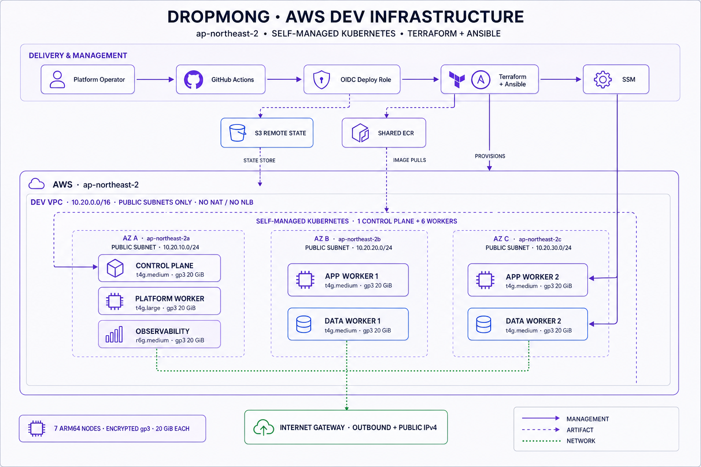
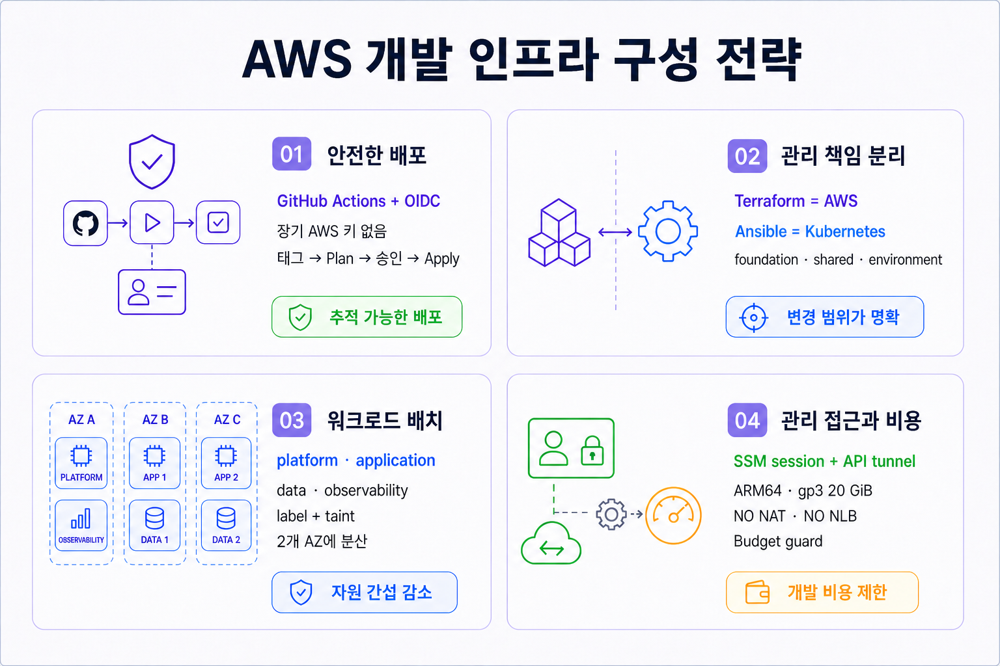

# MediKong Infra

MediKong의 AWS 자원과 self-managed Kubernetes 서버 구성을 관리합니다.

## 명령어

### AWS

AWS Access Portal: [https://d-9b675860d9.awsapps.com/start](https://d-9b675860d9.awsapps.com/start)

```bash
# AWS SSO 최초 설정
# SSO start URL: https://d-9b675860d9.awsapps.com/start
aws configure sso --profile dropmong-infra-admin
aws configure set region ap-northeast-2 --profile dropmong-infra-admin
aws configure set output json --profile dropmong-infra-admin
aws sso login --profile dropmong-infra-admin
aws sts get-caller-identity --profile dropmong-infra-admin

# AWS 배포 기반 최초 구성
AWS_PROFILE=dropmong-infra-admin task terraform:foundation:bootstrap

# 이미 foundation이 있는 계정에서 OIDC Role 권한 변경을 먼저 검토·반영
AWS_PROFILE=dropmong-infra-admin task terraform:foundation:plan -- -no-color
AWS_PROFILE=dropmong-infra-admin task terraform:foundation:apply CONFIRM=foundation -- -no-color

# AWS 개발 환경 로컬 plan
task aws-dev:plan -- -no-color

# 다음 배포 태그 미리 보기
task aws-dev:deploy:tag MODE=bootstrap BUMP=patch DRY_RUN=true

# AWS 개발 환경 최초 배포 또는 shared 변경 배포
task aws-dev:deploy:tag MODE=bootstrap BUMP=patch

# 일반 AWS 개발 환경 변경 배포
task aws-dev:deploy:tag MODE=release BUMP=patch
```

### private-dev

```bash
task private-dev:ssh-setup-all
task ssh:private-dev
task private-dev:bootstrap
```

## 제공 환경

| 환경 | 저장소에서 제공하는 구성 |
| --- | --- |
| `aws-dev` | Terraform AWS 자원과 Ansible Kubernetes 구성 |
| `private-dev` | 기존 서버 inventory, SSH ProxyJump와 Ansible Kubernetes 구성 |

## AWS 개발 환경 기본값

아래 내용은 현재 AWS 계정의 배포 상태가 아니라 `terraform/environments/dev`를 적용할 때 생성되는 기본 구성입니다.



| 구분 | 구성 |
| --- | --- |
| 리전 | `ap-northeast-2` |
| 네트워크 | VPC `10.20.0.0/16`, 3개 AZ의 public subnet |
| 관리 | AWS Systems Manager |
| Ansible 연결 | `amazon.aws.aws_ssm`, EC2 instance ID, 전용 임시 S3 전송 버킷 |
| SSH 키 | 사용하지 않음 |
| control plane | `t4g.medium` 1대 |
| platform worker | `t4g.large` 1대 |
| application worker | `t4g.medium` 2대 |
| data worker | `t4g.medium` 2대 |
| observability worker | `r6g.medium` 1대 |
| 운영체제 | Ubuntu 24.04 ARM64 |
| Kubernetes | kubeadm 기반 self-managed cluster |
| 스토리지 | 노드별 gp3 20GiB |




### 트레이드오프와 운영 기준

| 선택 | 얻는 점 | 대가와 운영 기준 |
| --- | --- | --- |
| control plane 1대 | 개발 환경 비용과 kubeadm 구성이 단순함 | 인스턴스나 `ap-northeast-2a` 장애 중에는 API와 스케줄링이 중단됩니다. 장기 운영 환경은 3대 control plane, etcd 백업과 API load balancer가 필요합니다. |
| 3개 public subnet, NAT/NLB 없음 | NAT 고정비가 없고 각 노드가 직접 외부 패키지·이미지에 접근함 | 7개의 public IPv4 비용이 발생하고 모든 노드가 인터넷 라우팅 영역에 놓입니다. 현재 외부 ingress는 열지 않지만 Security Group 오설정의 영향이 커지므로 운영 환경은 private subnet, VPC endpoint, 제한된 ingress 계층을 검토해야 합니다. |
| SSM 네이티브 관리 | 공개 SSH 포트, bastion, EC2 Key Pair 없이 IAM으로 접근을 통제함 | SSM, IAM, 노드의 외부 통신 경로와 Ansible 임시 전송용 S3가 동시에 정상이어야 접속할 수 있습니다. VPC endpoint가 없는 현재 구성은 Internet Gateway 경로 장애 시 관리 접점도 잃으므로 복구 절차를 별도로 준비해야 합니다. |
| self-managed kubeadm | Kubernetes 버전, CNI, 노드 구성과 비용을 직접 통제함 | control plane 업그레이드, 인증서, etcd 백업, 노드 교체와 장애 복구를 팀이 책임집니다. 운영 부담이 비용 절감보다 커지는 시점에는 EKS 같은 관리형 control plane과 비교해야 합니다. |
| 노드 로컬 gp3 20 GiB | 개발용 데이터와 로그를 가장 낮은 복잡도로 저장함 | 노드 교체 시 로컬 데이터가 사라지고 이미지·로그가 빠르게 디스크를 채울 수 있습니다. 중요한 데이터는 원격 백업, 별도 영속 스토리지, 사용량 경보와 정리 정책이 필요합니다. |
| 역할별 전용 worker | 리소스 간섭을 줄이고 배치 의도를 label·taint로 명확히 함 | platform과 observability는 각각 1대라 해당 노드 장애 시 기능이 사라집니다. 트래픽이나 텔레메트리가 늘면 역할별 2대 이상과 AZ 분산이 필요합니다. |
| ARM64와 T 계열 `standard` credit | 시간 제한 개발 환경에서 가격 대비 자원이 유리하고 surplus credit 비용을 피함 | ARM64 이미지를 제공하지 않는 도구는 실행할 수 없고 지속 부하에서는 T 계열 CPU가 제한될 수 있습니다. CI에서 multi-arch 이미지를 검증하고 부하가 계속되면 비버스터블 Graviton으로 바꿔야 합니다. |
| 노드 간 전체 통신을 허용하는 단일 Security Group | kubeadm과 CNI에 필요한 east-west 포트를 단순하게 보장함 | 한 노드가 침해되면 다른 노드로 이동하기 쉬운 넓은 신뢰 구역이 됩니다. Kubernetes NetworkPolicy, 역할별 Security Group 또는 노드 방화벽으로 단계적으로 범위를 줄여야 합니다. |

다이어그램은 생성형 이미지이므로 Terraform처럼 자동으로 동기화되지 않습니다. 노드 수, CIDR, 인스턴스 타입, 접속 경로가 바뀌면 코드 변경과 함께 이 그림도 다시 검토해야 합니다. 재생성 요구사항은 `terraform/diagrams/aws-dev-architecture-overview.prompt.md`에 보관합니다.

## 1일 환산 비용

위 기본 구성을 기준으로 EC2와 public IPv4는 하루 10시간, gp3는 24시간 사용한다고 가정한 환산값입니다.

| 항목 | 계산 | 예상 비용 |
| --- | --- | ---: |
| EC2 | 7대, 10시간 | `$3.522` |
| public IPv4 | 7개, 10시간 | `$0.350` |
| gp3 | 140GiB, 24시간 | `$0.426` |
| 합계 | 부가세 전 | **`$4.298`** |
| 원화 환산 | `1 USD = 1,600 KRW`, 부가세 10% 포함 | **`약 7,564원`** |

인터넷 전송, AZ 간 전송, ECR, snapshot 비용은 포함하지 않습니다.

## Terraform 구성

| 분류 | Terraform root | 자원 |
| --- | --- | --- |
| 배포 기반 | `terraform/foundation` | Terraform 상태 저장용 S3 버킷, GitHub OIDC provider, 배포용 IAM Role |
| 공유 | `terraform/shared` | ECR repository, lifecycle policy, 버전 관리가 꺼진 Ansible SSM 임시 전송 S3 버킷 |
| 환경별 | `terraform/environments/dev` | VPC, subnet, IAM, EC2, SSM 관리 경로 |

## 폴더 구성

```text
infra/
├── Taskfile.yml                         # 공개 명령 프록시
├── docs/                                # 운영 및 배포 문서
├── terraform/
│   ├── Taskfile.yml                     # Terraform 명령 구현
│   ├── foundation/                      # 상태 버킷, GitHub OIDC와 배포 Role
│   ├── shared/                          # 환경 공용 AWS 자원
│   ├── environments/dev/                # AWS 개발 환경 자원
│   └── diagrams/                        # 아키텍처 다이어그램
├── infra/cluster/
│   └── provision/ansible/
│       ├── roles/                       # 공통 Kubernetes 설치 role
│       └── environments/
│           ├── aws-dev/                 # AWS inventory와 playbook
│           └── private-dev/             # Private inventory와 playbook
├── k8s/                                 # Kustomize 기반 Kubernetes 리소스
└── .local/                              # plan과 생성 inventory, Git 제외
```

## 사전 준비

- Terraform `1.10.0` 이상
- Task `3.x`
- AWS CLI와 `dropmong-infra-admin` IAM Identity Center 프로필
- aws-dev Ansible 실행 시 Session Manager 플러그인, `boto3`, `amazon.aws` collection
- private-dev에서만 사용할 SSH key

`task aws-dev:plan`은 `AWS_PROFILE`을 따로 지정하지 않으면 `dropmong-infra-admin`을 사용하고, SSO 세션이 없거나 만료되면 `aws sso login`을 실행합니다. 이 명령은 상태 버킷을 확인하고 shared와 dev workspace의 plan만 저장하며 EC2, VPC, S3를 생성하지 않습니다.

GitHub Actions는 저장된 Access Key 대신 OIDC로 `AWS_ROLE_ARN` Role의 짧은 수명 자격 증명을 받습니다. aws-dev Ansible은 SSH를 사용하지 않고 SSM 세션을 열며, 모듈 파일은 상태 버킷이 아닌 전용 S3 버킷을 잠시 거칩니다. 해당 버킷은 public access를 차단하고 AES256으로 암호화하며, 버전 관리를 켜지 않고 남은 파일을 하루 뒤 삭제합니다.

GitHub Actions 등록 방법은 [`docs/github-actions-registration.md`](docs/github-actions-registration.md)를 확인합니다.
