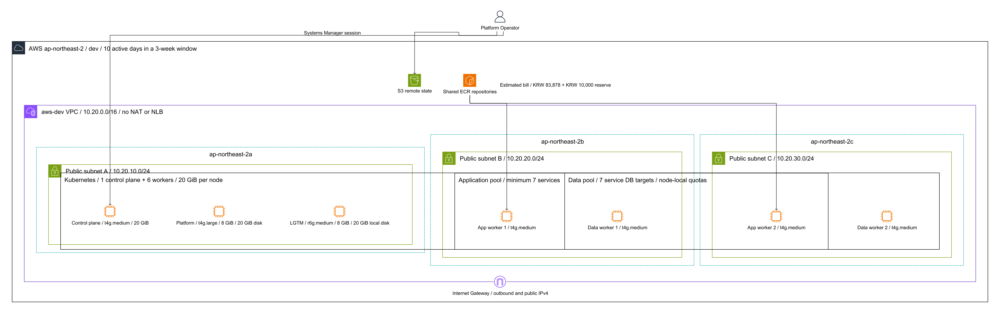

# MediKong Infra

MediKong의 AWS 자원과 self-managed Kubernetes 서버 구성을 관리합니다.

## 명령어

### AWS SSO 최초 설정

```bash
aws configure sso --profile dropmong-infra-admin
aws configure set region ap-northeast-2 --profile dropmong-infra-admin
aws configure set output json --profile dropmong-infra-admin
aws sso login --profile dropmong-infra-admin
aws sts get-caller-identity --profile dropmong-infra-admin
```

### AWS 배포 기반 최초 구성

```bash
AWS_PROFILE=dropmong-infra-admin task terraform:foundation:bootstrap
```

### AWS 개발 환경

```bash
# 최초 구성 배포
git tag -a infra-aws-dev-bootstrap-v0.1.0 -m "Bootstrap AWS dev"
git push origin infra-aws-dev-bootstrap-v0.1.0

# 인프라 변경 배포
git tag -a infra-aws-dev-v0.1.1 -m "Release AWS dev v0.1.1"
git push origin infra-aws-dev-v0.1.1
```

### Private 개발 환경 구성

```bash
task private-dev:ssh-setup-all
task ssh:private-dev
task private-dev:bootstrap
```

## 제공 환경

| 환경 | 구성 |
| --- | --- |
| `aws-dev` | Terraform으로 AWS 자원을 만들고 Ansible로 Kubernetes를 구성 |
| `private-dev` | 기존 서버 inventory와 SSH ProxyJump를 사용해 Kubernetes를 구성 |

## AWS 개발 환경



| 구분 | 구성 |
| --- | --- |
| 리전 | `ap-northeast-2` |
| 네트워크 | VPC `10.20.0.0/16`, 3개 AZ의 public subnet |
| 관리 | AWS Systems Manager |
| control plane | `t4g.medium` 1대 |
| platform worker | `t4g.large` 1대 |
| application worker | `t4g.medium` 2대 |
| data worker | `t4g.medium` 2대 |
| observability worker | `r6g.medium` 1대 |
| 운영체제 | Ubuntu 24.04 ARM64 |
| Kubernetes | kubeadm 기반 self-managed cluster |
| 스토리지 | 노드별 gp3 20GiB |

다이어그램 원본은 `terraform/diagrams/aws-dev-architecture.yaml`이며 `task terraform:diagram`으로 갱신합니다.

## 1일 예상 비용

EC2와 public IPv4는 하루 10시간, gp3는 24시간 사용을 기준으로 계산합니다.

| 항목 | 계산 | 예상 비용 |
| --- | --- | ---: |
| EC2 | 7대, 10시간 | `$3.522` |
| public IPv4 | 7개, 10시간 | `$0.350` |
| gp3 | 140GiB, 24시간 | `$0.426` |
| 합계 | 부가세 전 | **`$4.298`** |
| 원화 환산 | `1 USD = 1,600 KRW`, 부가세 10% 포함 | **`약 7,564원`** |

인터넷 전송, AZ 간 전송, ECR, snapshot 비용은 포함하지 않습니다.

## 자원 수명주기

| 분류 | Terraform root | 자원 |
| --- | --- | --- |
| 배포 기반 | `terraform/foundation` | Terraform 상태 저장용 S3 버킷, GitHub OIDC provider, 배포용 IAM Role |
| 공유 | `terraform/shared` | ECR repository와 lifecycle policy |
| 환경별 | `terraform/environments/dev` | VPC, subnet, IAM, EC2, SSM 관리 경로 |

## 폴더 구성

```text
infra/
├── Taskfile.yml                         # 공개 명령 프록시
├── terraform/
│   ├── Taskfile.yml                     # Terraform 명령 구현
│   ├── foundation/                      # 상태 버킷, GitHub OIDC와 배포 Role
│   ├── shared/                          # 환경 공용 AWS 자원
│   ├── environments/dev/                # AWS 개발 환경 자원
│   └── diagrams/                        # 아키텍처 다이어그램
├── infra/cluster/
│   └── provision/ansible/
│       ├── roles/                       # 공통 Kubernetes 설치 role
│       └── environments/
│           ├── aws-dev/                 # AWS inventory와 playbook
│           └── private-dev/             # Private inventory와 playbook
├── k8s/                                 # Kustomize 기반 Kubernetes 리소스
└── .local/                              # plan과 생성 inventory, Git 제외
```

## 사전 준비

- Terraform `1.10.0` 이상
- Task `3.x`
- AWS CLI 인증
- AWS CLI Session Manager 플러그인
- Private 개발 환경에서 사용할 SSH key

GitHub Actions 설정은 `.github/README.md`를 확인합니다.
